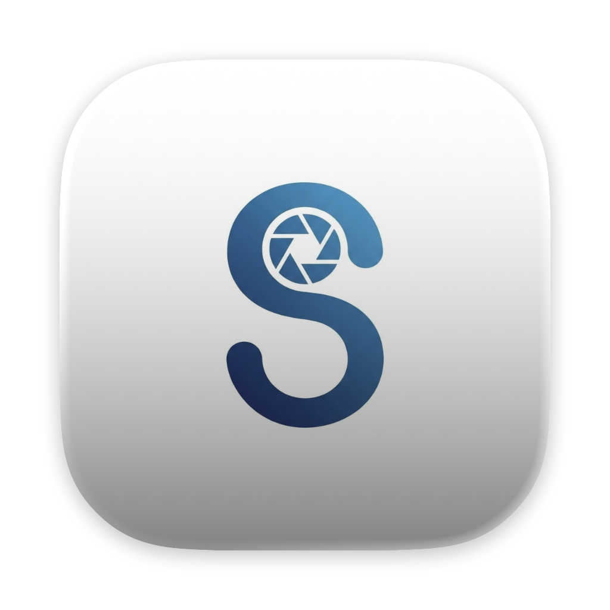

# aSnap

**A fast, lightweight screenshot tool that lives in your menu bar.**

Capture regions, scrolling pages, and full screens — then annotate,
OCR, pin, and share, all without leaving your keyboard.

## About the preview

aSnap is in **public preview**. Preview builds are free to use and each
build is valid for **180 days** from its release date (the exact date is
shown in every release's notes).

When a build reaches the end of its window, screenshot capture is paused:

- ✅ Ink, laser pointer, and pinned images keep working
- ✅ Your capture history stays accessible — open, copy, save, and pin
  earlier screenshots at any time
- ⛔ New captures (region, scroll, full screen, OCR) are paused

Download the newest preview from the
[Releases page](https://github.com/tacshi/aSnap-Release/releases/latest) to
pick up right where you left off. The app also shows a notice in its menu
bar menu when a newer preview is available.

## Install

1. Download the `.dmg` from the
   [latest release](https://github.com/tacshi/aSnap-Release/releases/latest).
2. Open it and drag **aSnap** into **Applications**.
3. Launch aSnap from Applications — it appears in your menu bar.

On first use, macOS will prompt for **Screen Recording** and
**Accessibility** permissions (System Settings → Privacy & Security).

**Requirements:** macOS on Apple Silicon or Intel (universal binary).

## Highlights

- **Capture modes** — Region (⌘⇧1) with window/element snapping, Scroll
  (⌘⇧2) that auto-scrolls and stitches long content, Full Screen (⌘⇧3),
  and Pin (⌘⇧P) to float a screenshot above all windows
- **Region selection** — freeform drag or auto-snap to windows and UI
  elements, resize handles, and a 10x magnifier loupe with pixel
  coordinates
- **Annotations** — shapes, arrows, freehand pencil and marker, mosaic
  (pixelate/blur) redaction, number stamps, and text, with undo/redo
- **OCR & QR** — extract text from screenshots and copy it instantly;
  QR codes are auto-detected and one click copies their contents
- **Screen presentation** — draw on screen with Ink or point with the
  Laser during demos and calls
- **Quick actions** — copy PNG straight to the clipboard, save with
  auto-generated filenames, pin, or discard with Escape

## Feedback

Found a bug or have a suggestion? Please
[open an issue](https://github.com/tacshi/aSnap-Release/issues) — feedback
during the preview directly shapes the 1.0 release.

When reporting a bug, it helps to include:

- The preview version (aSnap menu → Settings, or the DMG file name)
- Your macOS version
- Steps to reproduce, and a screenshot or recording if the issue is visual

---

© MonkeyT3ch. All preview builds are code-signed and notarized for macOS.

